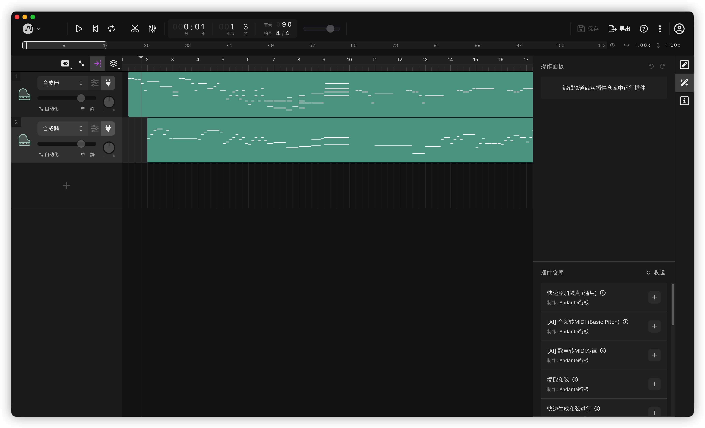
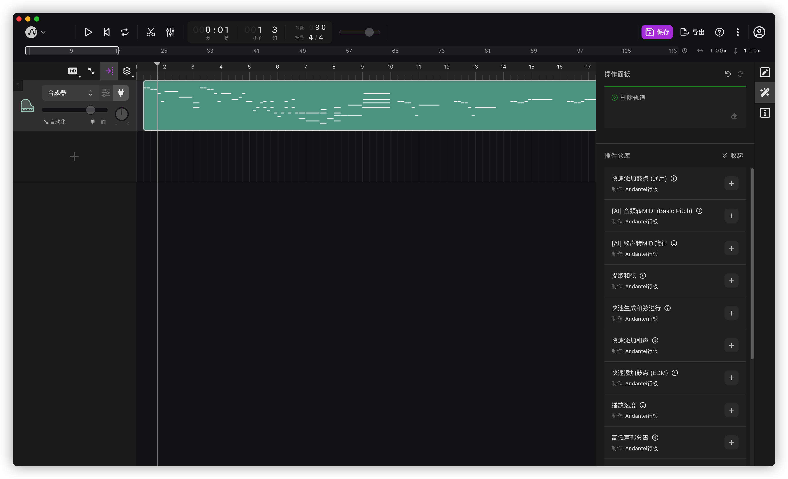
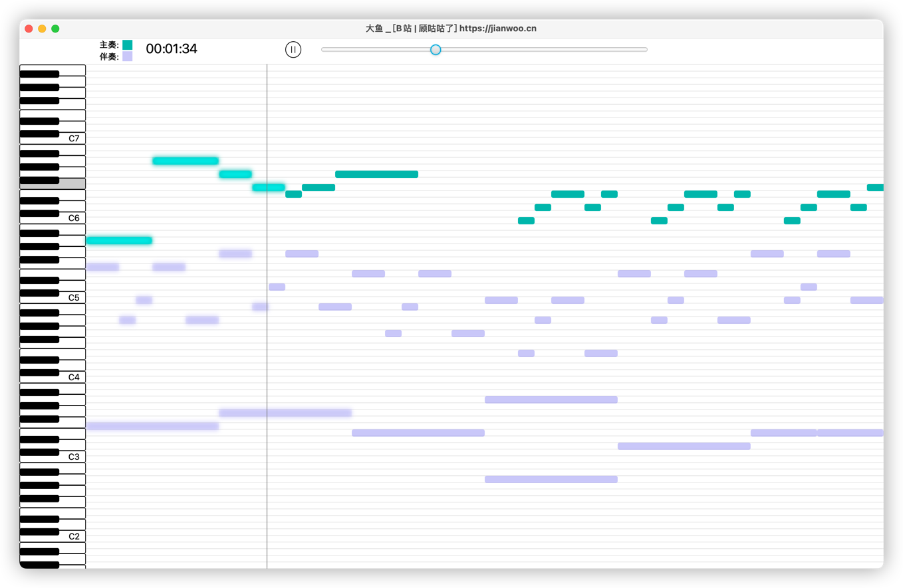
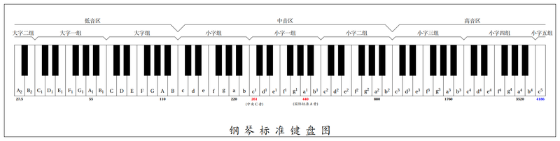
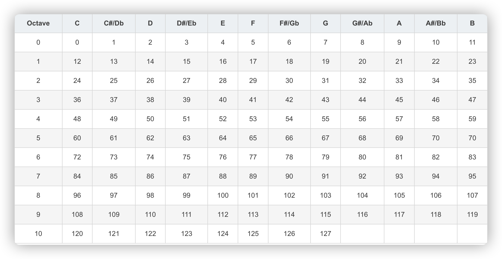
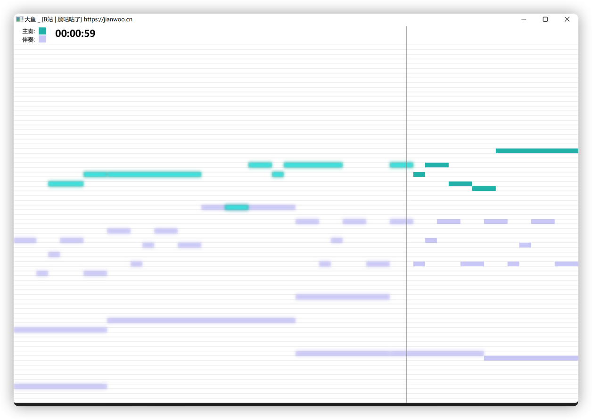

## 2.2.0 版本
1. 新增XML 文件中节奏(BPM)的设置
2. 新增伴奏音量比主奏略低的功能 (原播放 jar 包从 maven 依赖中移除，使用自己编译的扩展包[jlayer-extend-1.0.2.0-SNAPSHOT.jar]，在 lib 目录下，以支持音量调整)
3. 新增生成 XML 的功能 (具体步骤见下面的教程)
4. 上传了一些歌曲的 xml 文件
5. 优化部分代码逻辑
6. 修复了一些已知问题

### 生成 XML 文件步骤
  1. 在网上搜索有关歌曲的 midi 简谱，比如midishow网站(https://www.midishow.com/)
  2. 使用 midi 编辑器打开midi 文件，比如 Logic Pro，Tune Flow(https://tuneflow.com/), Tune Flow在线也可以编辑，也有多个平台的客户端
  3. 将 midi 文件删除伴奏轨道，只剩一个主奏轨道，如图(tuneFlow截图 1~2.png)，然后导出 midi
  4. 然后将主奏文件使用类(cn.jianwoo.genXml.GenStart)生成 xml 文件
  5. 导出伴奏 xml 文件的方法同理
  6. 导出后根据BPM，重置 xml 中的header.audio.midi.bpm节点

#### tuneFlow截图 1

#### tuneFlow截图 2

## 2.1.0 版本
1. 新增暂停/播放按钮
2. 新增进度条，可拖动
3. 新增左侧钢琴面板，点击时可弹奏
4. 新增主面板的音符可弹奏播放对应的键音
5. 优化指针动画算法
6. 修复了一些已知问题
#### 2.1.0 版本截图

## 2.0.0 版本
### 1、音符重构
主奏和伴奏支持 钢琴 88 键全音符，包括 低音区、中音区和高音区，之前的数字音符改为标准的字母音符，中央 C 音为 C5,等同于第一版的"1"，
 如下图:

从钢琴简谱最左边开始，依次为

`[A1,A#1,B1],[C2,C#2,D2,D#2,E2,F2,F#2,G2,G#2,A2,A#2,B2] ~`
`[C8,C#8,D8,D#8,E8,F8,F#8,G8,G#8,A8,A#8,B8],[C9]`

带#的是半音符，即黑键，比如do 和 re之间就有个黑键，通俗点说就是这个音比do的音高一点，比re的音低一点。具体的乐理知识还请各位百度吧。
在类`Convert.convert()`方法中可以将之前的类转换成字母音符，之前的 "0" 也转换成了标准的停顿音(R)。

#### 音符和其值对应图表

### 2、解析方式重构
之前是通过字符串+空格分隔的方式进行解析的，边运行边解析，效率低下，这次是通过对象的方式进行解析，提升了运行效率，也解决了主奏和伴奏不同步的情况，并且支持通过 xml 或者 json 方式解析成 NodeBO 对象，
每个音符支持自定义时长，开始时间，并且支持同一音轨多个音符同时演奏的曲子。节点定义如下： 
`note `

`--key `

`--value `

`--duration `

`--length `

`--startTime `

`--endTime `

`--multiple `

`--time `

`--multNote `

`----key `

`----value `

`----length `

具体的含义这个业务对象的实体类有注释说明。
### 3、动画重构
之前控制台的动画单一，我实在有点看不下去了，就开发了个 GUI 图形界面，一开始是通过AWT 开发的，运行起来有点卡，并且动画也不怎么好看，样式单一，后来又通过javaFx组件开发的(注意，这需要 **JDK 11**及以上版本才可以运行)。GUI 支持每个音符的动态显示，指针根据时间线指向具体的音符。
具体的 javaFx 包需要到 https://gluonhq.com/products/javafx/ 根据不同的操作系统环境下载具体的包，然后把包里的 lib 库添加到项目中。
#### 2.0.0 版本截图

## 1.0.0 版本
### 1、主奏与伴奏中支持输入的35个音符：
 “1--” ~ “7--”， “1-” ~ “7-”， “1” ~ “7”， “1+” ~ “7+”， “1++” ~ “7++”
分别代表倍低音、低音、中音、高音、倍高音一共35个音符

### 2、分别在主奏(.note)与伴奏(.accompaniments)中输入需要自动弹奏的音符
 2.1 每个音符之间用空格隔开(任意多个空格，推荐每个音符包括空格共占用4个占位符，以便主奏和伴奏音符对齐)

 2.2 输入字符"0"，则会使音长额外延长一倍；

 2.3 输入除了上面35个音符以及“0”以外的任意字符不会对弹奏起任何作用；

 2.4 如果需要换行填写，则需在上一行的末尾以及下一行的开头都加上空格;

### 3、音长里输入每两个音符之间的间隔时长，单位是毫秒(ms)
 建议输入整片谱子的最短的间隔，其余更长的的间隔可以利用延时加倍解决

## 参考 / 鸣谢
 本项目1.0.0 版本 参考自 [@fightingHawk2001](https://github.com/fightingHawk2001)

 本项目只保留了根据音符播放音乐的功能。原作者的项目中含有带图形GUI 界面的钢琴演奏器，如有需要请跳转到原项目: https://github.com/fightingHawk2001/MyPiano。